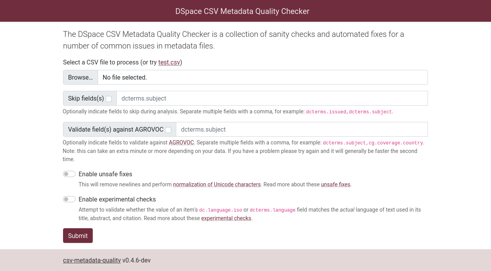

<h1 align="center">Online DSpace CSV Metadata Quality Checker</h1>

<p align="center">
  <a href="https://github.com/ilri/csv-metadata-quality-web/actions"></a>
  <a href="https://github.com/psf/black"></a>
</p>

<p align="center">
  
</p>

## Usage
Create a Python 3.10+ virtual environment and install the dependencies:

    $ python3 -m venv venv
    $ source venv/bin/activate
    $ pip install -r requirements.txt

## Running Locally

    $ gunicorn csv_metadata_quality_web.main

And then visit http://localhost:8000/ in your browser.

## Running Behind nginx

Set the `SCRIPT_NAME` environment variable to the path you will reverse proxy from:

    $ gunicorn csv_metadata_quality_web.main --env SCRIPT_NAME=/csv-metadata-quality

Then use a configuration snippet like this in nginx:

```
    location /csv-metadata-quality {
        include proxy_params;
        proxy_pass http://127.0.0.1:8000;
    }
```

## License
This work is licensed under the [GPLv3](https://www.gnu.org/licenses/gpl-3.0.en.html).

The license allows you to use and modify the work for personal and commercial purposes, but if you distribute the work you must provide users with a means to access the source code for the version you are distributing. Read more about the [GPLv3 at TL;DR Legal](https://tldrlegal.com/license/gnu-general-public-license-v3-(gpl-3)).
