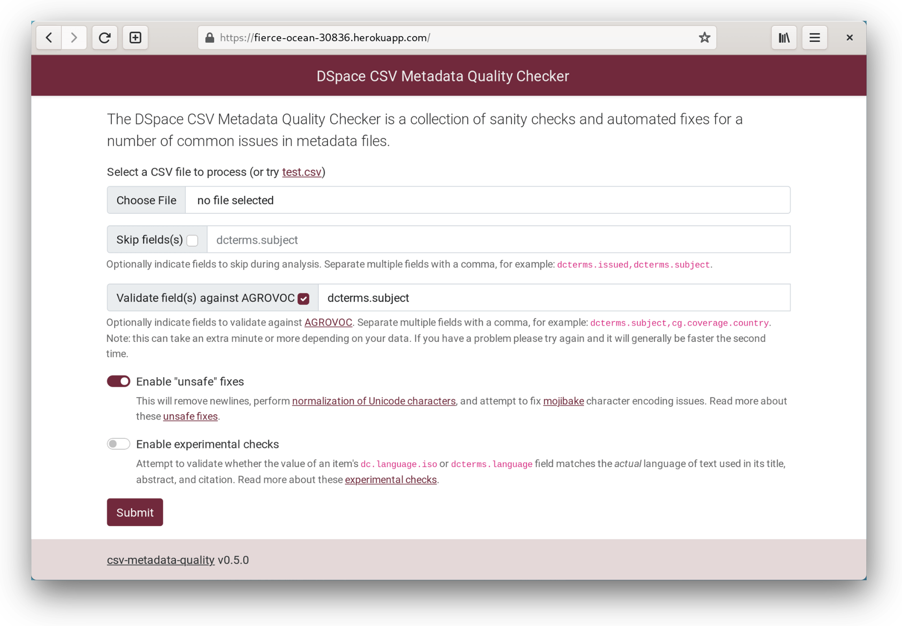

  

<h1 align="center">Online DSpace CSV Metadata Quality Checker</h1>

  
  

You can try [the hosted version](https://fierce-ocean-30836.herokuapp.com) or host it yourself (see below).

## Usage
Create a Python 3.7+ virtual environment and install the dependencies:

    $ python3 -m venv venv
    $ source venv/bin/activate
    $ pip install -r requirements.txt

## Running Locally

    $ gunicorn csv_metadata_quality_web.main

And then visit http://localhost:8000/ in your browser.

## Deploying to Heroku
Install the heroku command line tools, add a heroku git remote, and push:

    $ git push heroku

## License
This work is licensed under the [GPLv3](https://www.gnu.org/licenses/gpl-3.0.en.html).

The license allows you to use and modify the work for personal and commercial purposes, but if you distribute the work you must provide users with a means to access the source code for the version you are distributing. Read more about the [GPLv3 at TL;DR Legal](https://tldrlegal.com/license/gnu-general-public-license-v3-(gpl-3)).
